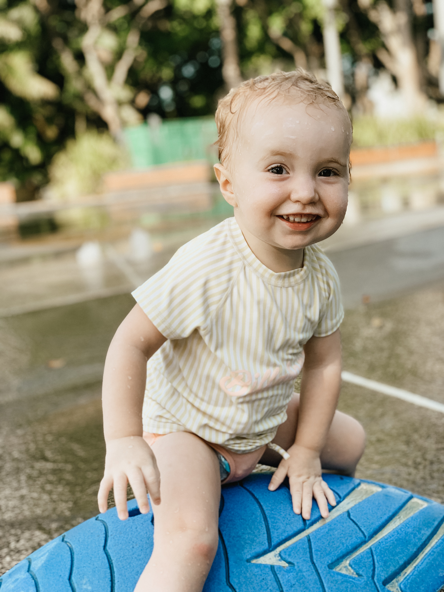
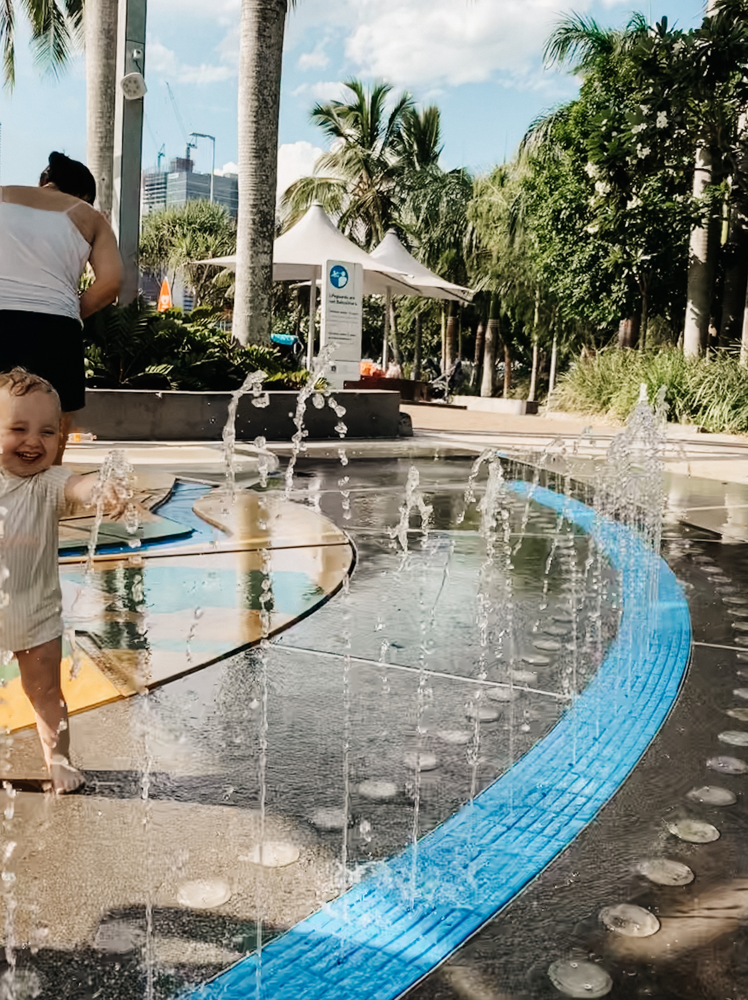
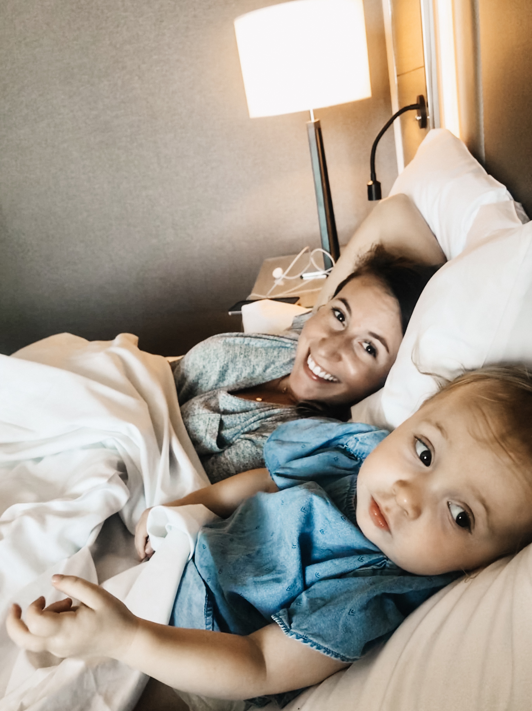
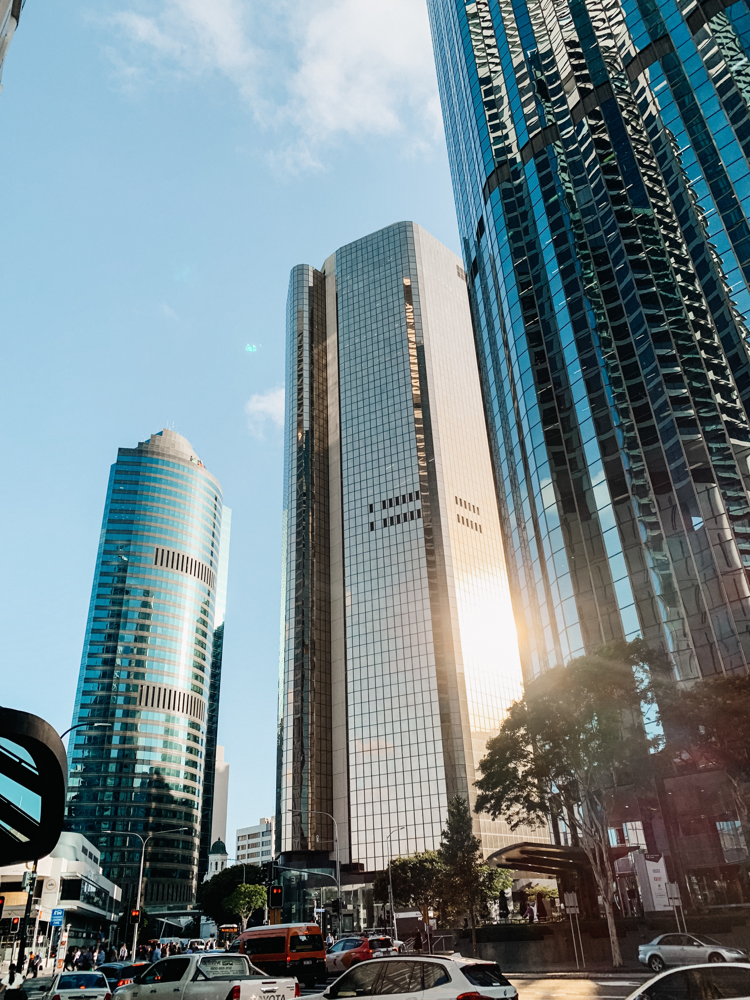

We didn’t stay in Brisbane as long as planned, because we had some really good friends to meet up with farther north of Brisbane on the Sunshine Coast! They booked their tickets to Australia and then called us up saying “I think we are going to be in Brisbane the same time as you.” What a crazy thing right!? It was easy to modify our reservation at the Marriott in Brisbane and that is what we did. We had about two days in Brisbane and we loved having an air conditioned hotel room! And took the free ferries that Brisbane offers a few times to get to different areas. The highlight was going over to the park on the river. You can look up either Riverside Green Playground or Streets Beach to get there. The city has built in a huge splash pad, beach area (complete with sand!), and a pool area. It was amazing and Stella absolutely LOVED it. After hating the water for a month and a half she finally enjoyed playing in the water again. We also ate at the Korean BBQ restaurant not far from our hotel and it was everything we dreamed of. We love Korean BBQ, and we went early enough that it wasn't crowded and Stella played with her stickers in the high chair basically the entire time. The name of the restaurant is Maru Korean BBQ. We thought it was strange they didn’t give us many sauces for the meat, but we ended up asking for some salt and that really did the trick. Those were basically our highlights in Brisbane! It is a fun city, not as big as Sydney, and at first impression did not feel as kid-friendly (but maybe we were just in a very specific area). Overall Brisbane was a fun place to stay, especially in a hotel, and we are glad we visited! 

Thanks for reading!

Xo, Lindsay

 

 

 

 

 

 

 

 

 

 
