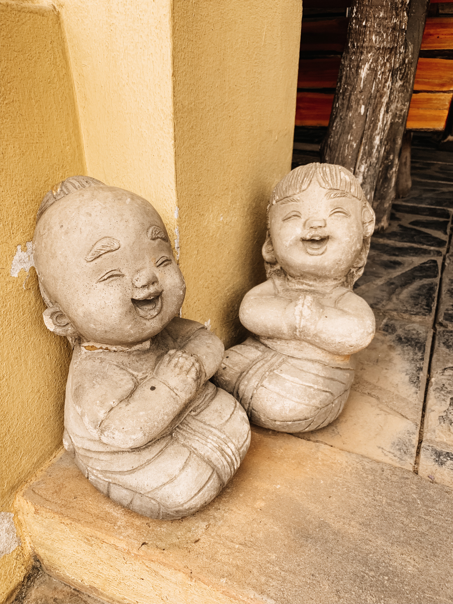

Can you say SMOG?! We laughed (that nervous, uh-oh laugh) when we touched down in Chiang Mai because it looked like we were downwind of a wildfire. The air was thick and smelt  of smoke. A quick google search revealed that Chiang Mai proudly owns the top spot on the global worst-air-quality list. 

This is one of those things you wish you would have looked up before booking the trip. But, we knew we would only be here for a week, so we figured we’d be ok. The smog fluctuated during the time we were in Chiang Mai, but it was always WAY beyond comfort level. In fact, the last day we were there, we decided not to go outside at all because the air quality was terrible.

Luckily, we still managed to have a great time in Chiang Mai. The main contributors were 1) A nice condo and 2) a few specially-selected activities outside the city.

Lindsay found our condo on Airbnb. We walked there from the airport (very nice) and it was right across the street from a large, western-style mall. We were about a 10-minute car ride from Chiang Mai proper, but that wasn’t much of an issue as we could easily find a “Songthaew” (red truck / taxi) to take us into the city for a couple dollars. We took advantage of the small kitchenette to make mug cookies several times (nothing like a good, American-style chocolate chip cookie!). It was also very refreshing to have a smart TV (we binged a bit of Netflix on the smog-ridden days).

We wrote about the Elephant Nature Park and Cooking Class separately. These were certainly the highlights of Chiang Mai. But, there were some other cool things in the city.

The first night we went to the Sunday night market. We found it to be really lackluster and much smaller than expected. A few days later we learned that the market was actually cancelled that night!?! It was election day. So, the few vendors that did turn out were not representative of the actual Sunday market. We’ve heard several people tell us that the market is cool, so if you go to Chiang Mai, definitely give it a shot.

We checked out a few of the temples around the city including Wat Chedi Luang and Wat Phra Singh. Each was impressive as are all of the temples in Asia. Stella has caught on that people sit down and bow to the earth in temples and was encouraging us to do the same (She’s also VERY excited about praying over food these days… spiritual awakening?).

I thought the Thai food in Chiang Mai was the best we’ve had. I felt like the “soup” (curry as we know it) in southern Thailand was much more watery whereas in Chaing Mai they embraced the coconut milk a bit more. I’m all about the richness of the coconut milk! The best dish I had (ate it many times) was Kao Soi:  A burma-inspired curry broth over a mix of crispy and boiled egg noodles served with a stewed chicken leg. It is spicy but amazing. I want more.

We didn’t get to go to Doi Suthep (a cool temple on a hill overlooking the city) due to the smog, but would recommend it if you go!

Thanks for reading,

Abe

 

 

 

 

 

 

 

 

 

 

 

 
