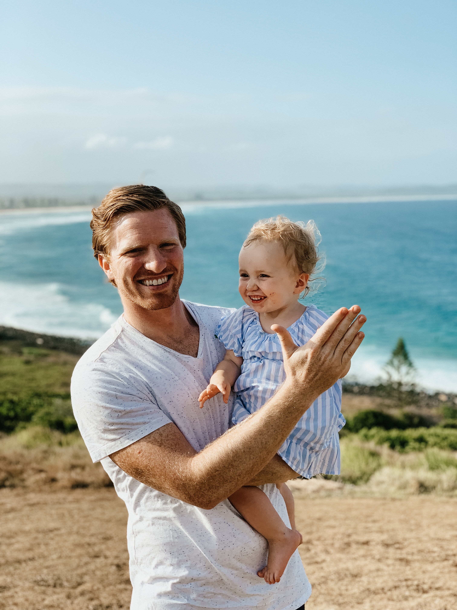
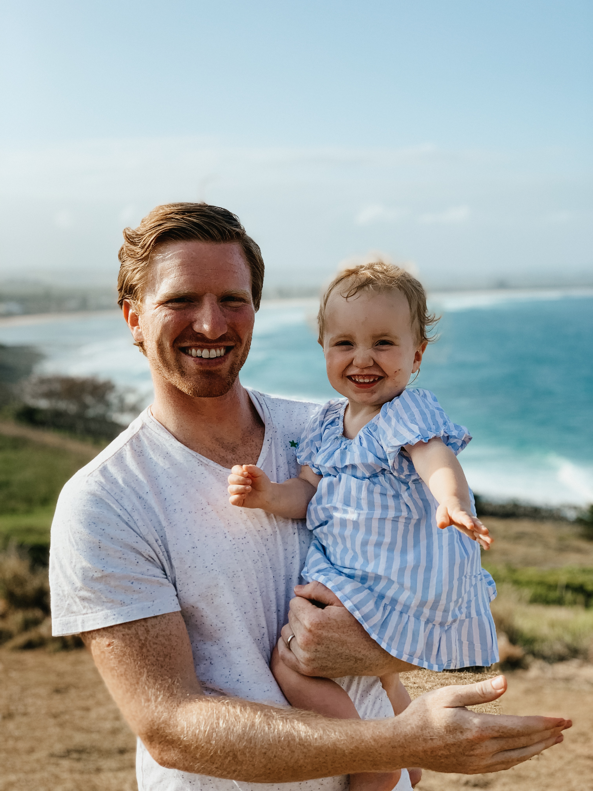
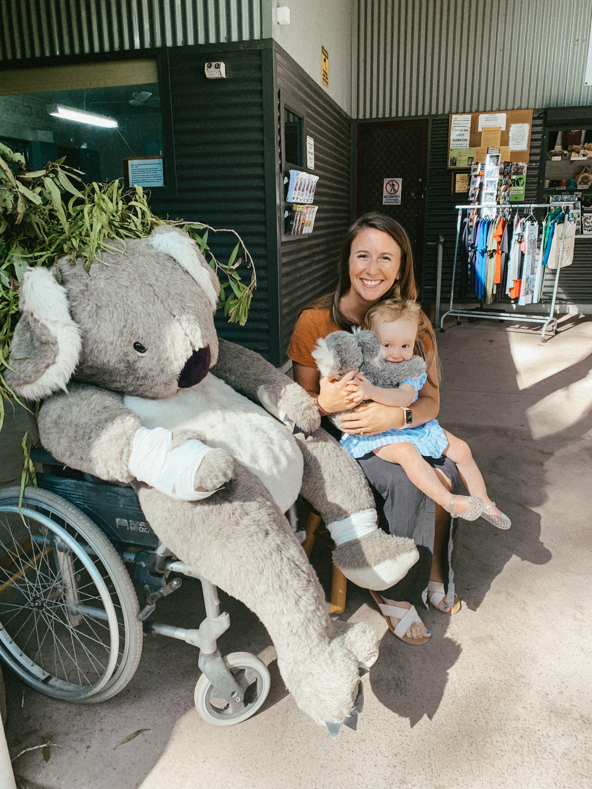
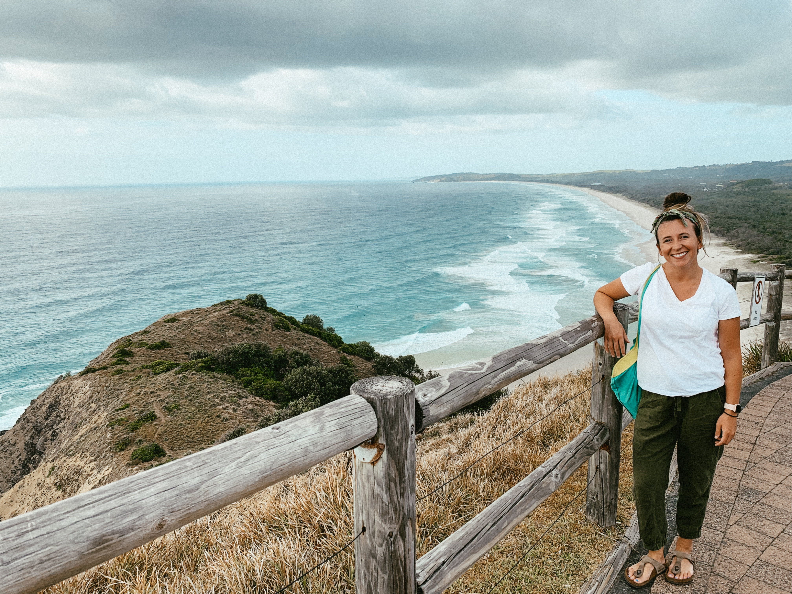
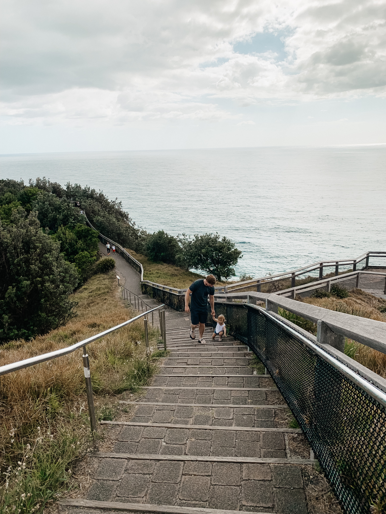

We took a weekend to drive from Sydney to Brisbane thinking it would be more of a coastal drive. Unfortunately it wasn't, but we don’t regret the road trip at all. It was so nice to have an air conditioned car and just be able to go wherever we wanted. 

We decided it would be best for our marriage if I drove while in Australia (you guys think I'm exaggerating but I'm really not haha). I’m the worst (or the BEST!? I'll leave that up to you to figure out) backseat driver.. So I decided to drive since this was going to be on the opposite side of the road and generally I trust my observation skills more than Abe’s. You think I’m kidding maybe but I’m really not. It was best for our sanity for me to drive. Plus Abe is way better at entertaining Stella in the car and has way more patience for that. He also makes better animal noises than me. So really it wasn't a hard decision at all. 

This was definitely my first experience driving on the opposite side of the road. It took a minute to get the hang of, but all in all, wasn’t bad and did not take very long to figure out. The hard part was at the beginning trying to navigate and drive through downtown Sydney to get on our way! Driving in big cities is tough no matter what city it is. 

Our first day we drove 4.5 hours to Port Macquarie, which is a tiny tiny TINY town on the coast. We got there and everything was closed at like 4pm? So we went to the grocery store and Abe made us a delicious dinner. We stayed in the cutest Airbnb. I would have stayed more days at this Airbnb if it wasn't totally in the middle of nowhere. The next morning we went to the Koala Hospital in Port Macquarie and that was such a cool experience! The Koala Hospital is totally free. We went first thing in the morning before we headed to church. They have a few different koalas all there for different reasons. Some are being treated to be reintroduced to the wild, some are there for life based on their needs. It was amazing to see them so up close and not in a huge crowd. We were able to see some of them eat and climb while we were there. Stella loved the big stuffed koala animal they had in a wheelchair, and she also loved all of the statues of koalas they had around the area. 

After church we drove another 4.5 hours to Byron Bay, with a stop at Coffs Harbor. We stopped at this viewpoint at Byron Bay and it was incredible! At this point in the road trip I was getting extremely tired of driving and it was really nice to get out an explore and see the views. 

We stayed the night in Byron Bay and explored a bit of the downtown by the beach area and it is such a fun area! So many good food places and such a fun vibe. The next morning we went to explore the Byron Bay lighthouse. Definitely recommend this! It was a pretty short walk and the views are unreal. We really enjoyed stopping at Byron Bay. After that we started our drive into Brisbane, with a stop at Currumbin Wildlife Sanctuary. Of course Stella falls asleep for the longest amount of time in the car on the day we have to drive the least amount. We stopped and got some really really bad food at a weird chipotle like chain.. But really not good. Once we were parked at Currumbin Wildlife Sanctuary we waited for Stella to wake up. We eventually woke her up because she just kept sleeping. This is the place we met the kangaroos. I think both Abe and I were expecting this to be more of an open sanctuary (which it IS for the kangaroo part) but it is definitely set up like a zoo. It was extremely crowded but worth it for us to be able to interact with some kangaroos. Stella of course loved it, as she loves all animals. We were happy we stopped here to check a major thing off our list: meet a kangaroo!

We drove into Brisbane and I dropped Abe & Stella and all of our stuff off at the hotel. I returned the rental car and ubered back to the hotel. There was a fun pool at the hotel and we were in a great area! And that ends our road trip! 

I don’t think I’d recommend driving from Sydney to Brisbane, but more fly into Brisbane and drive to/from Byron Bay. The only thing I’d recommend on our drive that is far way from Brisbane is the Koala Hospital in Port Macquarie, but that in and of itself wouldn’t be worth the roadtrip.. Unless you really really want to see these specific koalas. Byron Bay is definitely the best town we stopped at on the coast, and if you are going to Brisbane I’d definitely recommend renting a car and spending a day or two there! I think we would have liked to spend 2-3 days there. There is such a fun beach shopping area with tons of shops and good food and a fun beach! Just overall fun vibes (unlike the old lady at church in Port Macquarie who told us “ah byron bay where all the hippies smoke all the potties” ( and don't forget to say that in an Australian accent hahaha). 

Thanks for reading!
Linds 

 

 

 

 

 

 

 

 

 

 

 

 

 

 

 

 

 

 

 

 

 

 

 

 

 
