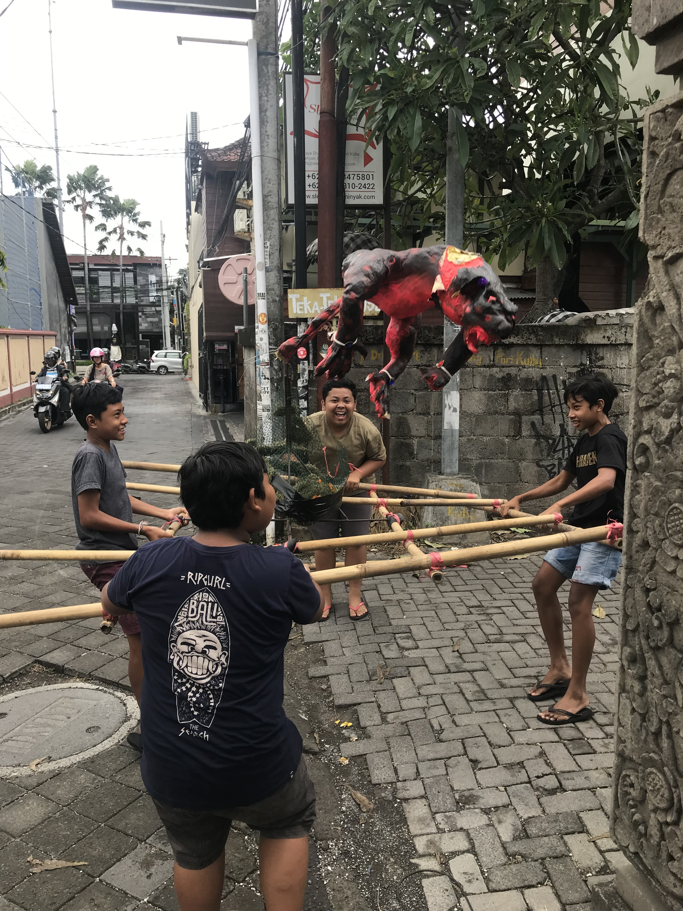
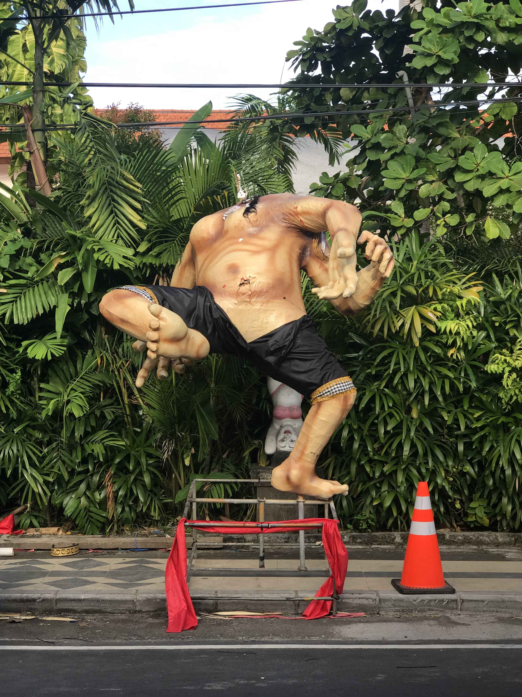

Today is Silence day. It’s New Year’s Eve according to the 210 day Balinese calendar. But, I’m quite sure the experience here is unlike any New Year you’ve celebrated. Locally, it’s known as Nyepi and constitutes a 24hr period from 6am until 6am. During this time the Balinese follow 5 very strict rules:

1) No fire
2) No working
3) No entertainment or pleasure
4) No walking / traveling outside the family compound
5) No eating (and for some, no talking!)

A little different than loud fireworks, booze, and music, eh? The Balinese are very strict in observance of this holiday. The only people outside of their homes are Balinese security who will fine you if you are seen outside. The airport shuts down. The electricity, internet, and phone services are turned off. Only emergency services like hospitals and fire brigades are still working.

The goal of the day is to allow the spirits of the island one day a year to roam. In the days leading up to Nyepi, Balinese create “ogoh-ogoh” statues that represent demons and parade them through the town. The parade culminates by burning the statues.

##Our experience 

We had no idea about Nyepi when we booked our trip, so we ended up shuffling things around so that we would be in a good place for Silent Day (somewhere we could still have food, light, and wifi!). We had spent a few days on Lembongan (a small island about a 45-min boat ride away). People there said that the power to the island would be cut off along with the internet. Thinking about being in a bungalow without air conditioning or lights with a 1.5yr old was enough to make us want to get to a western-style hotel. 

We decided to stay as long as we could on Lembongan since it’s a great small Island with the feel that we were after when we decided on Bali as a destination. We arranged for the last boat out leaving at 4:30pm. When we got to the station, it started pouring rain and storming. At this point the worker let us know that the boat was delayed. Also, by his calculation we would not be able to find a ride to Kuta (where our hotel was) until 11pm or so because roads are shut down during the parades. Yikes. Sitting out in the rain for ours waiting for a taxi sounded horrific, but there weren’t many options. 

Eventually we got across the water back to the main Island of Bali. It turns out there were many roads closed, but we were still able to find a driver who could get us to the hotel. 

At our hotel, they have blackout curtains over all windows and doors. At night they require you to keep your curtains drawn. Luckily, they still provide food and wifi, but that is about it. A city that is usually quite busy with taxis and scooters became eerily quiet for 1 day.

We spent the day working, napping, and watching movies. It was a nice chance for recharge.

Thanks for reading,

Abe

 

