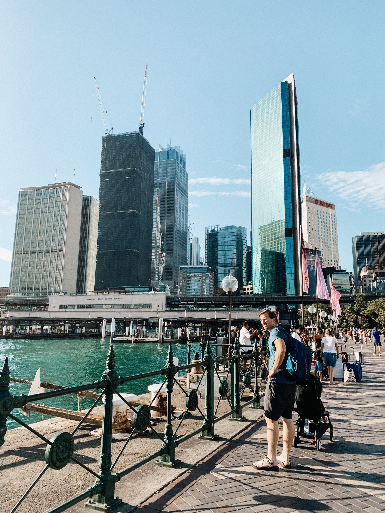

We spent a week in Sydney with Ben & Buffy and their kids Lulu & Alexander. Sydney is an amazing city! After a few hours there I turned and said to Abe “So how does one go about moving to a different country for no good reason?” There is so much to do and see, we barely scratched the surface. Unfortunately Stella was sick our week there, so that made for an even slower pace. 

Lunar New Year was on February 5th so there were new year celebrations all over Sydney. There were huge displays of a bunch of different animals for other years, like year of the Tiger, of the Monkey, of the Rat, etc etc. They were all up! But this year is the year of the PIG. So that definitely had the most displays up. There were also some cool stands and markets up on the weekend we arrived and when we left for Lunar New Year. 

Things we did while in Sydney:
Walked around the Sydney Opera House. This was a very low maintenance thing we did as it is only a 10 minute walk from where we were staying, and to be honest it was the only thing we did one day from dealing with the heat, Stella’s cough, and a little bit of jet lag. It was amazing to walk around and see in person and just walk up and down the steps. It is an incredible building and there are great views from there as it is right on the water. 

Took a ferry to Rose Bay and then walked to Bondi Beach. Wouldn’t necessarily recommend. It is about a 10 minute drive, but we did not have a carseat for Stella. We decided to walk it (45 minutes) which in the end was worth it because it was the only way to get there! It was a long and hot walk, but Bondi Beach was a fun place to be that day. The water felt so cold compared to Hawaii! It was quite refreshing. I would definitely recommend Bondi beach if you can drive there from Sydney. As for the walking, I’ll leave that up to you. Just drink plenty of water because I’m 100% sure I had some heat exhaustion after that day of so much walking and sun and not being used to it. I was super fatigued and not hungry. I didn’t start feeling like myself again for about 2 days, when I finally decided to drink something with electrolytes in it and man that really helped! I’m a believer in electrolyte balances now!

Taronga Zoo. One day we took a ferry over to the Taronga Zoo even though we weren’t totally sure about going to a zoo while in Syndey. But the views from the ferry and from the zoo itself are incredible! Not to mention the zoo is very well designed and makes it very easy to see all of the animals. To see the koalas it is designed in a circular ramp and walking around from top to bottom you can see the koalas from all different levels and sides. We took a gondola ride up to the entrance from the ferry dock (you can only do this if you have pre-purchased tickets, which  I just did on my phone) and while looking down we saw a mama and baby elephant taking a mud bath together! We saw the gorillas and koalas pretty close up too. There was a lot there that we didn’t get to do because #toddlers. But it was totally worth it. Would highly recommend! 

Darling Harbour area. We explored over at Darling Harbour and found this amazing kids park and splash pad. This was the first area Stella started feeling more comfortable with water! The splash pad is intricately designed with water gates that you can open and shut and move from side to side to direct the flow of water. There is a lot more that makes this splash pad and park cool but you’ll just have to see it for yourself. There are also a lot of food places around Darling Quarter that makes it easy to find something to eat and it is just a nice area to hang around! To get here from Circular Quay you can take the train and then walk a bit, or take the train and then transfer to the light rail. The public transportation in Sydney is WONDERFUL. 

*Quick note about public transit in Sydney: buy an opal card. We bought ours right before we got on the train at the airport. It is easy to add money to it and you just “tap on and tap off” to use the transportation. This works for the ferries, the train, and the light rail! 

Paddy’s Market. We stopped by Paddy’s Market after we visited Darling Quarter since it was a quick walk away. Paddy’s Market is a huge marketplace with a bunch of different vendors with bags, clothing, anything with I LOVE AUSTRALIA on it, and more. It was fun walking around it and Stella took a quick nap in the stroller while we walked around. 

We also visited the “Bohemian” part of town called “Newtown”. This area felt very very very much like the Mission District in San Francisco! Some cute shops here and there, a bunch of food places, and a bunch of local businesses all around. It was a cool area to walk around! We came here after we visited Paddy’s Market since we could just get on the light rail again and go a few more stops. 

Here are a few food stops we ate at more than once while we were there because of convenience and because they were good! These places were really close to us and made the morning so so easy with breakfast!

Tap Rooms-- we ate here our first night and then one night Abe & I went back when Ben & Buffy watched Stella for us. The first time they had a special going on and they had ONE peach caprese salad left and we ordered it. And I ate the entire thing in about a minute. It was delicious. Fresh peaches, tomatoes, mozzarella, basil, and balsamic vinegar. YUM. The second time I ordered the fried chicken sandwich and that was a 10/10. It also has a fun vibe. 

Dare Cafe-- went here basically every morning for smoothies and fruit salad and breakfast sandwiches. Their fruit salad was so good! It wasn’t three strawberries, one blueberry, one million bananas and a bunch of cantaloupe (because let’s be honest who actually enjoys cantaloupe). It was every kind of good fruit and a lot of it. Kiwi, watermelon, strawberries, blueberries, grapes, apples.. I know this is dumb to write about fruit salad but seriously it made my life when I could just buy a big bowl of yummy fruit in the morning. 

Bekya Mediterranean-- went here twice because we liked our order and it was fast and yummy! Just well done and simple mediterranean food. Bekya is in this huge food court called The Gateway right next to Circular Quay. There are a lot of options in that building! From crepes to burgers, you’ll find something you’re interested in. It was nice to know of a food place with a bunch of options by Circular Quay. 

Suzette’s Creperie

Patisserie 

Looks like we revisited a lot of our food places but it makes sense to me honestly because when you are travelling and have to figure out three meals a day, that is A LOT and takes up A LOT of time! I’ve been reminded how much food is a part of our daily lives and how it can be a huge challenge when travelling. I’ll plan to write a bit about our tips and how we manage the good the bad and the HANGRY when it comes to food + travelling. 

Overall our week in Sydney was a blast. Sydney is absolutely stunning and such a fun place to be. There is so much we didn’t get to do while we were here and hope to come back one day. 

Things I didn’t know about Australia:

BATS

AUSTRALIANS ARE SO NICE. literally the nicest people I’ve ever met. Everyone we interacted with was kind and funny and helpful. 

KOALA CROSSING SIGNS

Thanks for reading!

Happy Traveling!
Xo, the Clark family 

 

 

 

 

 

 

 

 

 

 

 

 

 

 

 

 

 

 

 

 

 

 

 

 

 

 

 

 

 

 

 

 

 

 
